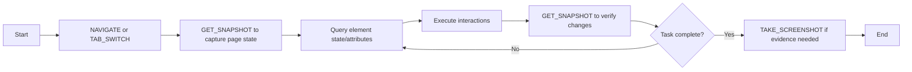

# Built-in Browser Automation Skills

This is the root index for all built-in browser automation capabilities. Use this skill for any task that requires interacting with web pages, controlling browser tabs, or automating web workflows.

## Core Capabilities

| Category | Description | Reference File |
|----------|-------------|----------------|
| Browser Orchestration | Navigate pages, read page info, manage tabs, and check debugger connectivity | [references/browser-orchestration.md](references/browser-orchestration.md) |
| Snapshot & Reference Management | Capture page structure, resolve element references, manage tab state | [references/snapshot-refs.md](references/snapshot-refs.md) |
| Element Query & Read Operations | Extract text, attributes, state, and properties from DOM elements | [references/element-queries.md](references/element-queries.md) |
| Element Interaction | Click, type, fill forms, scroll, and manipulate page elements | [references/element-interactions.md](references/element-interactions.md) |
| Visual Operations | Capture screenshots and visual evidence | [references/visual-operations.md](references/visual-operations.md) |
| Cookie Management | Read, set, and clear browser cookies | [references/cookie-management.md](references/cookie-management.md) |
| Storage Management | Access and modify localStorage, sessionStorage | [references/storage-management.md](references/storage-management.md) |
| Debugger & CDP | Attach debugger and send raw Chrome DevTools Protocol commands | [references/debugger-cdp.md](references/debugger-cdp.md) |
| Session Recording | Record and replay browser interaction sessions | [references/recording.md](references/recording.md) |

## Preconditions

1. **Browser Tab ID**: Ensure `typeId` is set to the target browser tab ID
2. **Navigation First**: Prefer `NAVIGATE` for page loads instead of raw `SEND_CDP` calls
3. **Element References**: Always prefer `selectorOrRef` values from a recent `GET_SNAPSHOT` result
4. **CDP Risk**: Treat `SEND_CDP` as high-risk - only use when standard actions cannot solve the task

## Recommended Workflow

## Guardrails & Best Practices

- **Minimal Commands**: Keep automation sequences minimal and deterministic
- **High-level First**: Prefer dedicated actions (`NAVIGATE`, `TAB_*`, `GET_*`) before falling back to `SEND_CDP`
- **Ref Validity**: Always re-snapshot after page navigation or significant content changes before reusing old element references
- **CDP Usage**: Avoid raw `SEND_CDP` commands unless absolutely necessary - prefer higher-level actions
- **Error Handling**: Check action results and validate state changes after each operation
- **Performance**: Batch related operations where possible to reduce round-trips

## Additional Resources

For detailed usage examples and parameter specifications, refer to the individual category documentation files linked above.

- Machine-readable action-to-doc index: [references/action-index.json](references/action-index.json)
